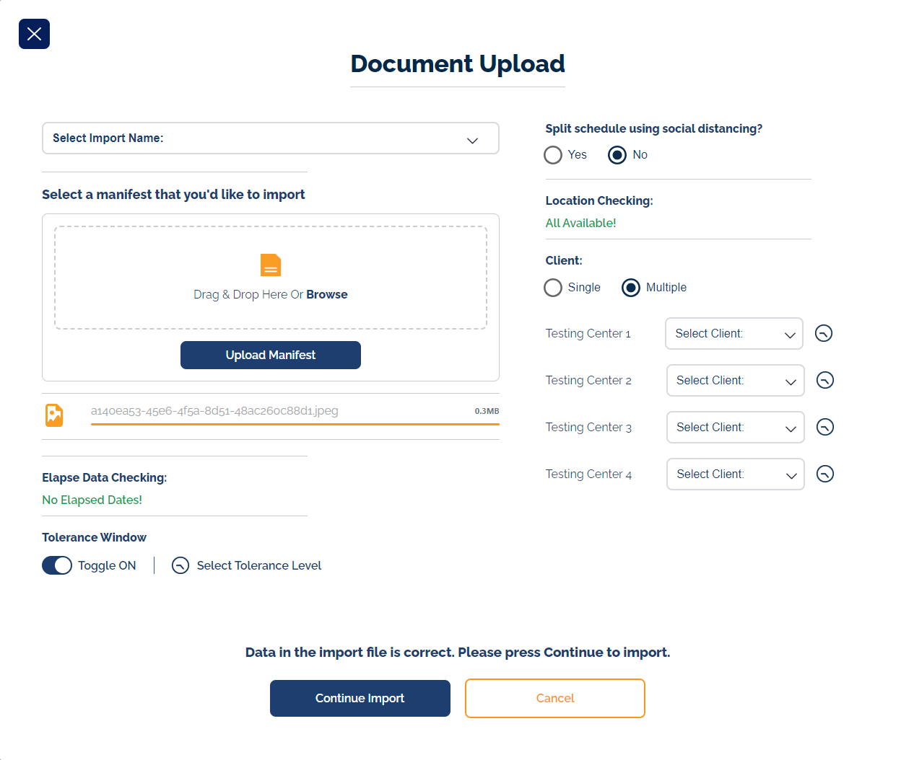

## Table of Contents

-   [Features](#features)
-   [Installation](#installation)
-   [Usage](#usage)

## Task

Attached is a mockup of a fictional screen. Create a react single page application that serves this page in the browser.

The only requirement is that you make it look exactly like the mockup using react components, form fields and any other technology you think makes sense.

Extra credit for making the drag & drop work to where I can put a file on the page and the filename pops up. Take this example as far as you want!

## Features

-   Looks exactly like the mockup
-   Drag and drop files
-   Form validation
-   Responsive design
-   Notifications, TimePicker, some animations etc...

## Installation

```bash
# Clone the repository
git clone <repository-url>

# Navigate into the project directory
cd <project-directory>

# Install dependencies
npm install
```

## Usage

```bash
# Start the developemnt server
npm run start
```
